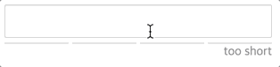

# react-password-strength-bar
A React component that displays the password strength bar

[](https://nodei.co/npm/react-password-strength-bar/)

[](https://www.npmjs.com/package/react-password-strength-bar)
[](https://www.npmjs.com/package/react-password-strength-bar)
[](https://github.com/prettier/prettier)
[](https://www.npmjs.com/package/react-password-strength-bar)



## Note
- This package is based on [zxcvbn](https://github.com/dropbox/zxcvbn).
`zxcvbn` is a powerful library, but its size is very large.
I recommend you use this package by code splitting.
- The input tag is not included. 
If you want to include the input tag, use the [mmw/react-password-strength](https://github.com/mmw/react-password-strength) package.

## Install
```
$ npm install react-password-strength-bar
```
```
$ yarn add react-password-strength-bar
```

## Usage
```js
import PasswordStrengthBar from 'react-password-strength-bar';

const { password } = this.state;
<PasswordStrengthBar password={password} />
```

## Props
#### className?: string;
#### style?: {};
#### scoreWordClassName?: string;
#### scoreWordStyle?: {};
#### password: string;
#### userInputs?: string[];
#### barColors?: string[];
#### scoreWords?: string[];
#### minLength?: number;
#### shortScoreWord?: string;

## Browser support
Tested with modern browsers.

## License
the MIT license.
